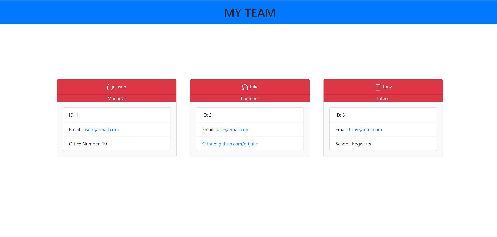

# Project Name
[](https://opensource.org/licenses/ISC)  

> This is a tool to help visually organize a team.

## Table of contents
* [General info](#general-info)
* [Screenshots](#screenshots)
* [Technologies](#technologies)
* [Setup](#setup)
* [Features](#features)
* [To-Do](#to-do)
* [Status](#status)
* [Inspiration](#inspiration)
* [Licenses](#licenses)
* [Contact](#contact)

## General info
> Create a team according to their job titles along with pertinent information.

## Screenshots


## Technologies
* HTML5
* CSS3
* JavaScript
* node.js
* Jest
* Inquirer

## Setup
```
node index
```

## Code Examples
Show examples of usage:
```
test('creates an Employee object', () =>{
    const employee = new Employee('anita', 0, 'anita@email.com');

    expect(employee.name).toBe('anita')
    expect(employee.id).toBe(0);
    expect(employee.email).toBe('anita@email.com')
});
```

## Features
* choose manager, engineer, intern
* load information for each
* see the employees displayed on a website

## To-Do
* add new features
* add new job titles


## Status
This project is in progress.  As new technologies and client needs evolve, so will this application.

## Inspiration
> When building a team it is good to see them displayed in a useable format.


## Licenses
[](https://opensource.org/licenses/ISC)  

## Contact
Created by [Jason Fletcher](blueink38@yahoo.com) - feel free to contact me!